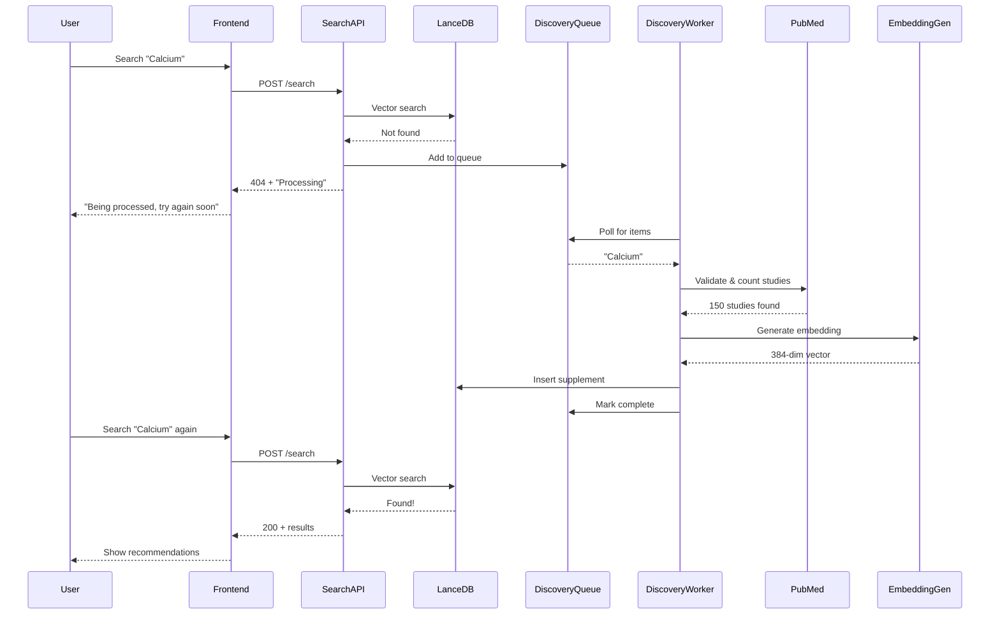

# Design Document

## Overview

This design implements a complete auto-discovery system for supplements that handles the full lifecycle from user search to indexed supplement. When a user searches for an ingredient not in LanceDB, the system queues it for background processing, validates it against PubMed, generates embeddings, and adds it to the vector database—all without blocking the user experience.

The system follows an async-first architecture where search failures trigger discovery jobs that run independently. Users receive immediate feedback with helpful messaging, while the discovery worker processes ingredients in the background with robust error handling and retry logic.

## Architecture

### High-Level Flow



### Component Architecture

```
┌─────────────────────────────────────────────────────────────┐
│                         Frontend                             │
│  - Handles 404 with retry UI                                │
│  - Shows processing status                                   │
│  - Polls for completion (optional)                           │
└─────────────────────────────────────────────────────────────┘
                              │
                              ▼
┌─────────────────────────────────────────────────────────────┐
│                      Search API Lambda                       │
│  - Vector search in LanceDB                                  │
│  - On miss: add to discovery queue                           │
│  - Return 404 with helpful message                           │
└─────────────────────────────────────────────────────────────┘
                              │
                    ┌─────────┴─────────┐
                    ▼                   ▼
┌──────────────────────────┐  ┌──────────────────────────┐
│      LanceDB (EFS)       │  │  Discovery Queue (DDB)   │
│  - Vector storage        │  │  - Pending ingredients   │
│  - HNSW index            │  │  - Processing status     │
│  - 384-dim embeddings    │  │  - Retry count           │
└──────────────────────────┘  └──────────────────────────┘
                                         │
                                         ▼
                              ┌──────────────────────────┐
                              │   Discovery Worker       │
                              │  - Poll queue            │
                              │  - Validate with PubMed  │
                              │  - Generate embeddings   │
                              │  - Insert to LanceDB     │
                              │  - Retry on failure      │
                              └──────────────────────────┘
                                    │           │
                          ┌─────────┘           └─────────┐
                          ▼                               ▼
                ┌──────────────────┐          ┌──────────────────┐
                │   PubMed API     │          │  Embedding Gen   │
                │  - Study count   │          │  - MiniLM-L6-v2  │
                │  - Validation    │          │  - 384-dim       │
                └──────────────────┘          └──────────────────┘
```

## Components and Interfaces

### 1. Search API Lambda (Modified)

**Location**: `backend/lambda/search-api-lancedb/lambda_function.py`

**Responsibilities**:
- Perform vector search in LanceDB
- On cache miss, add ingredient to discovery queue
- Return appropriate 404 response with processing status

**Interface**:
```python
def lambda_handler(event: Dict, context: Any) -> Dict:
    """
    Handle search requests with auto-discovery
    
    Returns:
        200: Search results found
        404: Not found, queued for discovery
        500: Server error
    """
    pass

def add_to_discovery_queue(ingredient: str, search_context: Dict) -> bool:
    """
    Add ingredient to DynamoDB discovery queue
    
    Args:
        ingredient: Normalized ingredient name
        search_context: User context (language, timestamp, etc.)
    
    Returns:
        True if successfully queued
    """
    pass
```

### 2. Discovery Queue (DynamoDB Table)

**Table Name**: `supplement-discovery-queue`

**Schema**:
```typescript
{
  ingredient_id: string;        // PK: normalized ingredient name
  status: 'pending' | 'processing' | 'completed' | 'failed';
  created_at: number;           // Unix timestamp
  updated_at: number;           // Unix timestamp
  retry_count: number;          // Number of processing attempts
  last_error?: string;          // Last error message
  pubmed_study_count?: number;  // Studies found in PubMed
  evidence_level?: 'low' | 'moderate' | 'strong' | 'none';
  embedding?: number[];         // Generated embedding (if completed)
  search_context: {
    user_language: string;
    original_query: string;
    timestamp: number;
  };
}
```

**Indexes**:
- Primary: `ingredient_id` (partition key)
- GSI: `status-created_at-index` (for polling pending items)

### 3. Discovery Worker Lambda

**Location**: `backend/lambda/discovery-worker-lancedb/lambda_function.py`

**Trigger**: EventBridge scheduled rule (every 1 minute) or DynamoDB Streams

**Responsibilities**:
- Poll discovery queue for pending items
- Validate ingredients with PubMed
- Generate embeddings
- Insert into LanceDB
- Update queue status
- Handle retries with exponential backoff

**Interface**:
```python
def lambda_handler(event: Dict, context: Any) -> Dict:
    """
    Process discovery queue items
    
    Returns:
        Dict with processing statistics
    """
    pass

def process_ingredient(item: Dict) -> ProcessingResult:
    """
    Process a single ingredient through the discovery pipeline
    
    Steps:
        1. Validate with PubMed
        2. Generate embedding
        3. Insert to LanceDB
        4. Update queue status
    
    Returns:
        ProcessingResult with success/failure details
    """
    pass

def validate_with_pubmed(ingredient: str) -> ValidationResult:
    """
    Validate ingredient exists in PubMed and count studies
    
    Returns:
        ValidationResult with study count and evidence level
    """
    pass

def should_retry(item: Dict) -> bool:
    """
    Determine if failed item should be retried
    
    Logic:
        - Max 3 retries
        - Exponential backoff: 1min, 5min, 15min
        - Don't retry validation failures (no studies found)
    """
    pass
```

### 4. Frontend Error Handling (Modified)

**Location**: `components/portal/ErrorMessage.tsx`, `lib/portal/useIntelligentSearch.ts`

**Responsibilities**:
- Display user-friendly 404 messages
- Offer retry functionality
- Show processing status
- Handle retry logic

**Interface**:
```typescript
interface DiscoveryErrorResponse {
  statusCode: 404;
  error: 'INGREDIENT_NOT_FOUND';
  message: string;
  details: {
    ingredient: string;
    status: 'queued' | 'processing';
    estimatedWaitSeconds: number;
    retryAfter: number;
  };
}

function handleDiscoveryError(
  error: DiscoveryErrorResponse,
  onRetry: () => void
): JSX.Element;
```

## Data Models

### Discovery Queue Item

```python
from dataclasses import dataclass
from typing import Optional, List
from enum import Enum

class DiscoveryStatus(Enum):
    PENDING = 'pending'
    PROCESSING = 'processing'
    COMPLETED = 'completed'
    FAILED = 'failed'

class EvidenceLevel(Enum):
    NONE = 'none'          # 0 studies
    LOW = 'low'            # 1-4 studies
    MODERATE = 'moderate'  # 5-20 studies
    STRONG = 'strong'      # 21+ studies

@dataclass
class DiscoveryQueueItem:
    ingredient_id: str
    status: DiscoveryStatus
    created_at: int
    updated_at: int
    retry_count: int
    last_error: Optional[str] = None
    pubmed_study_count: Optional[int] = None
    evidence_level: Optional[EvidenceLevel] = None
    embedding: Optional[List[float]] = None
    search_context: dict = None
    
    def should_retry(self) -> bool:
        """Check if item should be retried based on retry count and status"""
        return (
            self.status == DiscoveryStatus.FAILED and
            self.retry_count < 3 and
            self.evidence_level != EvidenceLevel.NONE  # Don't retry if no studies
        )
    
    def get_backoff_seconds(self) -> int:
        """Calculate exponential backoff delay"""
        return 60 * (5 ** self.retry_count)  # 60s, 300s, 1500s

@dataclass
class ProcessingResult:
    success: bool
    ingredient_id: str
    error: Optional[str] = None
    pubmed_study_count: Optional[int] = None
    evidence_level: Optional[EvidenceLevel] = None
    embedding: Optional[List[float]] = None
```

### LanceDB Supplement Schema

```python
@dataclass
class SupplementRecord:
    id: str                    # Normalized ingredient name
    name: str                  # Display name
    embedding: List[float]     # 384-dim vector
    pubmed_study_count: int
    evidence_level: str
    discovered_at: int         # Unix timestamp
    source: str                # 'legacy' | 'auto-discovery'
    metadata: dict             # Additional context
```

## Correctness Properties

*A property is a characteristic or behavior that should hold true across all valid executions of a system—essentially, a formal statement about what the system should do. Properties serve as the bridge between human-readable specifications and machine-verifiable correctness guarantees.*

### Property 1: Discovery queue insertion on search miss

*For any* ingredient search that returns no results from LanceDB, the ingredient should be added to the discovery queue with status 'pending'

**Validates: Requirements 1.1**

### Property 2: Non-blocking search response

*For any* ingredient not found in LanceDB, the search API should return a 404 response in less than 200ms, regardless of queue insertion success

**Validates: Requirements 2.1**

### Property 3: PubMed validation determines evidence level

*For any* ingredient processed by the discovery worker, the evidence level should be correctly classified based on PubMed study count: none (0), low (1-4), moderate (5-20), or strong (21+)

**Validates: Requirements 3.1, 3.2, 3.3, 3.4**

### Property 4: Rejected ingredients are not added to LanceDB

*For any* ingredient with zero PubMed studies, the discovery worker should mark it as failed and NOT insert it into LanceDB

**Validates: Requirements 3.5**

### Property 5: Retry with exponential backoff

*For any* failed discovery item with retry_count < 3, the system should retry processing with exponential backoff delays (60s, 300s, 1500s)

**Validates: Requirements 4.1**

### Property 6: Failed items marked after max retries

*For any* discovery item that fails after 3 retry attempts, the system should mark its status as 'failed' and stop retrying

**Validates: Requirements 4.2**

### Property 7: Successful discovery makes ingredient searchable

*For any* ingredient successfully processed and inserted into LanceDB, subsequent searches for that ingredient should return results (not 404)

**Validates: Requirements 1.5, 2.5**

### Property 8: Discovery queue metrics are recorded

*For any* ingredient added to or processed from the discovery queue, the system should emit CloudWatch metrics with ingredient_id, status, and timestamp

**Validates: Requirements 5.1, 5.2**

### Property 9: Frontend displays processing status

*For any* 404 response from the search API with discovery status, the frontend should display a message explaining the ingredient is being processed

**Validates: Requirements 6.1, 6.2**

### Property 10: Initial data pre-loading completes successfully

*For any* fresh deployment, all 70 legacy supplements should be loaded into LanceDB with embeddings before the system accepts user traffic

**Validates: Requirements 7.1, 7.2, 7.3**

## Error Handling

### Search API Errors

| Error | Status | Response | Action |
|-------|--------|----------|--------|
| Ingredient not in LanceDB | 404 | `INGREDIENT_NOT_FOUND` with discovery status | Add to queue, return immediately |
| Queue insertion fails | 404 | `INGREDIENT_NOT_FOUND` without discovery status | Log error, still return 404 |
| LanceDB connection fails | 500 | `DATABASE_ERROR` | Retry with circuit breaker |
| Invalid input | 400 | `INVALID_INPUT` | Return validation errors |

### Discovery Worker Errors

| Error | Retry? | Action |
|-------|--------|--------|
| PubMed API timeout | Yes | Exponential backoff, max 3 retries |
| PubMed returns 0 studies | No | Mark as failed with evidence_level='none' |
| Embedding generation fails | Yes | Retry with same backoff |
| LanceDB insert fails | Yes | Retry, preserve generated embedding |
| DynamoDB update fails | Yes | Retry status update separately |
| Max retries exceeded | No | Mark as permanently failed, alert |

### Retry Strategy

```python
def calculate_retry_delay(retry_count: int) -> int:
    """
    Exponential backoff with jitter
    
    Retry 1: 60s  ± 10s
    Retry 2: 300s ± 30s
    Retry 3: 1500s ± 60s
    """
    base_delay = 60 * (5 ** retry_count)
    jitter = random.randint(-base_delay // 6, base_delay // 6)
    return base_delay + jitter
```

### Circuit Breaker Pattern

For external dependencies (PubMed, LanceDB):
- Open circuit after 5 consecutive failures
- Half-open after 60 seconds
- Close after 3 consecutive successes

## Testing Strategy

### Unit Tests

**Search API**:
- Test queue insertion on LanceDB miss
- Test 404 response format
- Test response time < 200ms
- Test queue insertion failure handling

**Discovery Worker**:
- Test PubMed validation logic
- Test evidence level classification
- Test retry logic and backoff calculation
- Test LanceDB insertion
- Test status updates in DynamoDB

**Frontend**:
- Test 404 error message display
- Test retry button functionality
- Test processing status display

### Property-Based Tests

Each correctness property should be implemented as a property-based test using `hypothesis` (Python) or `fast-check` (TypeScript):

**Property 1 Test**: Generate random ingredient names, mock LanceDB to return empty, verify queue insertion
**Property 2 Test**: Generate random searches, verify response time < 200ms
**Property 3 Test**: Generate random study counts, verify correct evidence level classification
**Property 4 Test**: Generate ingredients with 0 studies, verify NOT in LanceDB after processing
**Property 5 Test**: Generate failed items with various retry counts, verify correct backoff delays
**Property 6 Test**: Generate items with retry_count=3, verify status='failed' and no more retries
**Property 7 Test**: Process random ingredient, verify subsequent search returns results
**Property 8 Test**: Generate queue operations, verify CloudWatch metrics emitted
**Property 9 Test**: Generate 404 responses, verify frontend displays correct message
**Property 10 Test**: Run initial load, verify all 70 supplements in LanceDB

### Integration Tests

- End-to-end flow: search miss → queue → worker → LanceDB → search hit
- PubMed API integration with real requests
- LanceDB EFS mount and vector operations
- DynamoDB queue operations
- CloudWatch metrics emission

### Performance Tests

- Search API response time under load
- Discovery worker throughput (items/minute)
- LanceDB insertion performance
- Queue polling efficiency

## Monitoring and Observability

### CloudWatch Metrics

**Search API**:
- `SearchMiss` - Count of ingredients not found
- `DiscoveryQueueInsertions` - Count of items added to queue
- `SearchResponseTime` - P50, P95, P99 latencies

**Discovery Worker**:
- `IngredientsProcessed` - Count by status (success/failure)
- `PubMedValidationTime` - Time to validate with PubMed
- `EmbeddingGenerationTime` - Time to generate embeddings
- `LanceDBInsertionTime` - Time to insert into LanceDB
- `RetryCount` - Distribution of retry attempts
- `QueueDepth` - Number of pending items

### CloudWatch Alarms

- Queue depth > 50 items (alert)
- Discovery worker error rate > 10% (alert)
- PubMed API error rate > 20% (warning)
- Average processing time > 30s (warning)
- Failed items with retry_count=3 (alert)

### Structured Logging

All components should log with structured JSON:

```python
{
  "timestamp": "2024-11-27T10:30:00Z",
  "level": "INFO",
  "component": "discovery-worker",
  "action": "process_ingredient",
  "ingredient_id": "calcium",
  "status": "success",
  "pubmed_study_count": 150,
  "evidence_level": "strong",
  "processing_time_ms": 2500,
  "correlation_id": "abc-123"
}
```

### X-Ray Tracing

Enable X-Ray for end-to-end tracing:
- Search API → Queue insertion
- Discovery Worker → PubMed → Embedding Gen → LanceDB
- Frontend → Search API (with retry attempts)

## Deployment Strategy

### Phase 1: Infrastructure Setup
1. Create DynamoDB discovery queue table
2. Deploy discovery worker Lambda with EFS mount
3. Create EventBridge rule for worker polling
4. Set up CloudWatch alarms

### Phase 2: Search API Modification
1. Add queue insertion logic to search API
2. Update 404 response format
3. Deploy to staging
4. Test with known missing ingredients

### Phase 3: Frontend Updates
1. Update error handling for discovery status
2. Add retry UI components
3. Test user flow
4. Deploy to production

### Phase 4: Initial Data Load
1. Run migration script to load 70 legacy supplements
2. Generate embeddings for all
3. Insert into LanceDB
4. Verify search functionality
5. Pre-populate DynamoDB cache

### Phase 5: Monitoring & Optimization
1. Monitor queue depth and processing times
2. Tune worker polling frequency
3. Optimize PubMed query performance
4. Adjust retry backoff parameters

## Security Considerations

- **Input Validation**: Sanitize ingredient names before queue insertion
- **Rate Limiting**: Limit queue insertions per user to prevent abuse
- **PubMed API**: Use API key, respect rate limits (3 requests/second)
- **EFS Access**: Restrict Lambda IAM roles to specific EFS mount points
- **DynamoDB**: Use least-privilege IAM policies for queue access
- **Secrets**: Store PubMed API key in AWS Secrets Manager

## Performance Targets

- Search API response (miss): < 200ms
- Queue insertion: < 50ms
- Discovery worker processing: < 30s per ingredient
- PubMed validation: < 5s
- Embedding generation: < 2s
- LanceDB insertion: < 1s
- Queue depth: < 20 items under normal load
- Success rate: > 95% for valid ingredients

## Future Enhancements

- **Batch Processing**: Process multiple ingredients in parallel
- **Smart Polling**: Adjust worker frequency based on queue depth
- **User Notifications**: Email/SMS when ingredient is ready
- **Caching**: Cache PubMed validation results
- **ML Validation**: Use ML to predict ingredient validity before PubMed check
- **Priority Queue**: Prioritize popular ingredients
- **Analytics**: Track which ingredients users search for most

